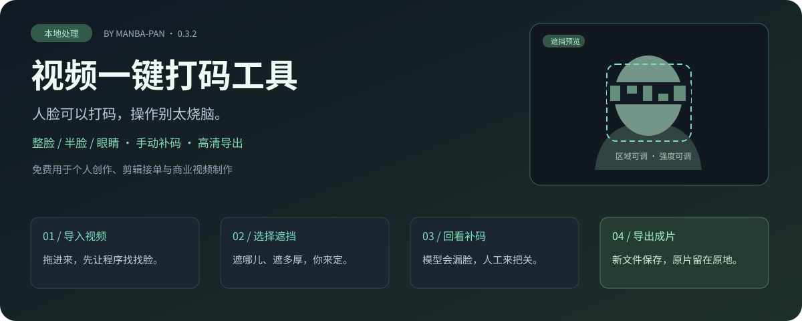
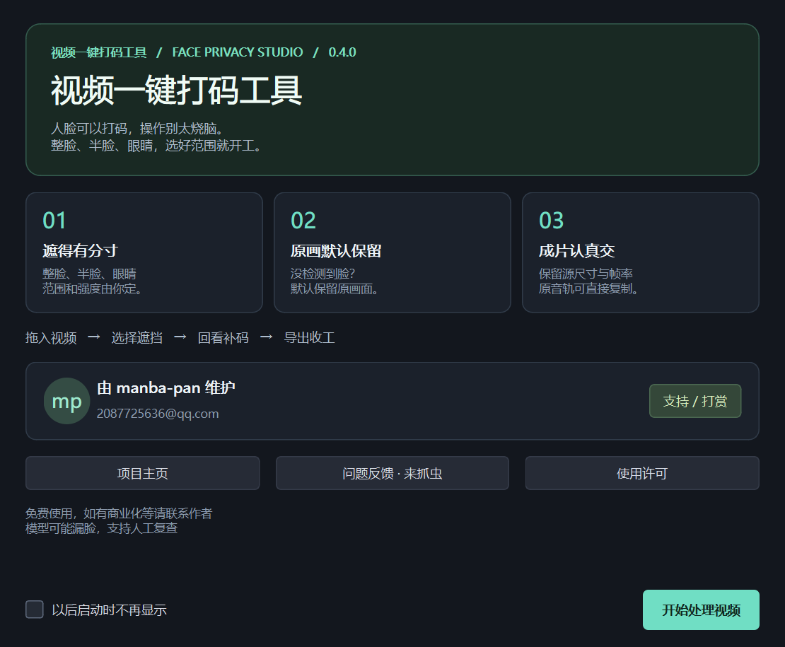

# 视频一键打码工具

当前工作分支为 **0.5.0 本地预览版**：新增 SDR 色彩空间／电平控制，以及保存前逐帧校验的源像素无损导出。使用方法、精度和格式边界见 [色彩与无损](COLOR_AND_LOSSLESS.md)。下方公开下载仍为 0.4.1，不包含这些新增功能。



把“这张脸得挡一下”变成几步能完成的事。**一键开始自动分析，细节仍由你掌控。** 支持整脸、半脸、眼睛遮挡，也能手动画框补码。视频在 Windows 本机处理，不需要账号、会员或其他剪辑软件。

作者：[manba-pan](https://github.com/manba-pan) · [问题反馈](https://github.com/manba-pan/face-privacy-studio/issues) · [使用许可与支持](COMMERCIAL.md)

| 打码有选择 | 原画有交代 | 导出有档位 |
| --- | --- | --- |
| 整脸 / 上下半脸 / 眼睛 | 未检测到人脸，默认保留画面 | 保留源尺寸与帧率 |
| 马赛克 / 模糊 / 实色，强度 1～5 档 | 手动关键帧补码，漏了可以补 | H.264 / ProRes / FFV1 |
| 覆盖范围、眼睛条高度单独调 | 导出另存新文件，原片不覆盖 | 原音轨直拷，或调整后转 AAC |

**模型可能漏脸，支持人工复查。** 侧脸、遮挡、小脸和运动模糊仍可能漏检，可以回看并手动补码。

**免费剪片，包括接剪辑单、制作广告和商业视频。** 软件本身的销售、收费服务或商业产品集成须事先另行书面授权。项目公开源码，采用自定义许可，非 OSI 标准开源许可；完整条款见 [LICENSE](LICENSE)。

## 从哪里开始

Windows 用户下载 [0.4.1 联网安装 EXE](https://github.com/manba-pan/face-privacy-studio/releases/download/v0.4.1/VideoRedactor-0.4.1-WebSetup.exe)，双击安装即可，不需要手动安装 Python。

**首次安装需要联网，另下载约 331 MB 的固定版本运行组件**，从官方 Python 软件包源获取并验证 SHA-256。安装完成后通过桌面快捷方式启动，视频在本机离线处理。网络失败可重新运行安装程序，完整且校验通过的下载会复用。支持 Windows 10 22H2 / Windows 11 x64；本机只实测 Windows 11。

所有附件与校验文件见 [Release 页面](https://github.com/manba-pan/face-privacy-studio/releases/tag/v0.4.1)。`WebSetup.exe` 是联网安装包；GitHub 自动生成的 Source code ZIP 是源码。运行组件获取方式见 [分发说明](DISTRIBUTION.md)。

新版 **0.4.1** 欢迎页用功能卡片讲清楚怎么用，主界面“作者 / 支持 / 反馈”随时可以打开。启动提示可以关闭，不会每次开工都拦住你寒暄。



从源码运行、参数说明和导出选择见 [完整使用说明](docs/USAGE.md)。

## 给作者加点续航

觉得省了时间，可以请作者喝杯茶。金额随心，量力而行；**不打赏也不影响任何功能**。发现 Bug、提建议、帮忙测试，也都是支持。

<table>
<tr><th>支付宝</th><th>微信</th></tr>
<tr><td></td><td></td></tr>
</table>

程序内也能打开和放大收款码、保存原图。付款前请在支付页面核对收款人。这里展示的是作者提供的静态收款码，软件不处理支付信息，打赏也不等于商业分发授权。

## 遇到问题，欢迎来抓虫

[提交问题或建议](https://github.com/manba-pan/face-privacy-studio/issues/new/choose)，写上程序版本、Windows 版本、复现步骤和错误提示即可。请勿公开私密视频；模型抓脸偶尔失手，反馈描述尽量别让作者也跟着盲猜。

授权或其他联系：[2087725636@qq.com](mailto:2087725636@qq.com)。

<details>
<summary>展开完整操作、画质说明和开发信息</summary>

构建面向 Windows x64。本机 Windows 11 已验证，尚未在另一台实体电脑或 Windows 10 实测。CPU 可以完成全部工作；兼容的显卡可用于 YuNet 推理、视频解码和 H.264 编码，各阶段分别选择。Qt 界面和带声音播放增加了包体积。


## 识别和加速怎么选

| 方案 | 做法 | 适用情况 |
| --- | --- | --- |
| 快速 | 640 尺寸找脸，检测间帧用短时光流跟踪，近似五官位置 | 先粗看长片，复杂转头和眼部遮挡需多检查 |
| 均衡（默认） | 两种尺度逐帧找脸，局部五官定位，低置信度候选复核 | 普通视频的日常选择 |
| 细致 | 更多尺度、镜像及第二模型复检，额外候选需验证，轮廓贴合面部 | 侧脸、画面边缘和部分遮挡，可能增加误检和耗时 |

0.4.1 已取消检测失败后的自动延续，避免把旧脸框拖到手、身体或下一个镜头。快速档只在两次检测之间做短时跟踪；完整检测发现无脸就停止。五官定位成功时使用面部轮廓，覆盖范围只放大一次。低置信度候选需交叉验证，可能让部分困难侧脸进入人工复查。

三种方案都可能漏脸，不能把“细致”理解成保证全遮住。整脸默认覆盖面部，不会自动把整个头部、耳朵或身体遮住。转头只剩后脑、脸被裁出画面时，可加手动框并设置关键帧。

“自动”推理会短测 CPU 与 DirectML，同一输入尺寸下 GPU 确实更快才选择 GPU；五官定位与部分图像处理仍在 CPU。手动指定 GPU 时，初始化或运行失败可回退 CPU。解码使用 D3D11VA，启动探测不可用则用 CPU；启动探测不等于硬件解码一定更快。

导出默认 CPU / H.264 CRF 14，保持画质优先。可选 AMD AMF、NVIDIA NVENC、Intel Quick Sync：先实际试编码，再使用可用设备；启动探测失败回退 CPU，运行中失败会停止并清理半成品。硬件质量参数不等价于 CPU 的 CRF，不能保证同体积同画质；ProRes 和 FFV1 仍用 CPU。

RX 9070 XT 上已实测 DirectML、D3D11VA 和 AMD AMF。其他品牌提供兼容入口，尚未在对应实体显卡逐一验收。具体测量及限制见 [验证记录](STUDIO_VERIFICATION.md)。

## 操作

1. 导入或拖入视频，支持多选。先直接播放原片，不自动分析或制作预览转码。选好识别方案后点击“开始打码”；批量分析与导出也由用户明确触发。
2. “遮挡”选择整脸、眼睛、上下半脸；马赛克、模糊、实色；强度 1～5 档。覆盖范围、眼睛条高度独立可调。
3. 默认未检测到人脸时保留原画面，空镜正常显示。可自行选择“整帧遮黑”。无脸也可能是漏检，请结合回看提示检查。分析过程中仍可预览，尚未分析的位置会明确提示；完成后保留当前播放位置。
4. Space 播放/暂停，左右键逐帧，点击时间线跳转。“对比原画”只影响预览；导出和快照仍使用处理后的画面。
5. I 设导出起点，O 设终点（包含当前帧）；“恢复整段”取消截取。浅绿色边界显示导出区间。
6. “补码”点击画框，在画面拖矩形，默认覆盖导出区间。选中已有框，在其他时间“重画关键帧”，中间位置和大小线性变化。时间输入的结束时刻不包含在补码范围内。
7. “画面 / 声音”提供旋转、移除音轨、AAC 音量调整、完整音轨提取；“导出”提供画质、尺寸、帧率。
8. 保存项目会记录原视频路径、参数、关键帧，不包含视频。重开会重新分析，原文件须保持位置和内容。退出前保存需要保留的操作。
9. 多素材可各设参数，也可应用当前参数到全部素材。截取范围和手动框分别保留。批量遇重名递增编号；单次导出要求新文件名，不覆盖原片。

## 画质与声音

| 预设 | 编码 | 用途 |
| --- | --- | --- |
| 高质量（默认） | H.264 / CRF 14 / medium / 8 位 4:2:0 | 画质优先的通用成片 |
| 均衡体积 | H.264 / CRF 18 / fast | 日常分享 |
| 后期中间片 | ProRes 422 HQ / 10 位 | 继续剪辑，文件较大 |
| 无损编码 | FFV1 / RGB / MKV | 无损保存处理后 RGB，文件很大 |

默认保留源分辨率与帧率，可以缩小或降帧率，不放大、不允许高于源帧率。奇数宽高补成偶数。变帧率输入按读取到的平均帧率统一成固定帧率，不原样保留逐帧时间戳。

打码必然改像素。H.264 和 ProRes 都有损，未遮挡区域也会重新压缩。FFV1 保证处理后 RGB 的编码无损，不保证源文件字节、原始 YUV 或元数据不变。10 位 SDR 用 RGB48 中间处理，要求 ProRes / FFV1；8 位转成 10 位不会增加原始细节。

当前面向普通 SDR / Rec.709。HDR、HLG、PQ、BT.2020 会阻止视频导出，需先受控转换。没有完整色彩管理、AI 补帧、超分、全部相机元数据保留、字幕或多音轨导出。快照为 8 位 PNG。

音频默认保留第一条音轨的原编码。兼容 MP4 的音轨直接封装 MP4；PCM 等音轨自动用 MOV。完整音轨直接复制；PCM 截取按采样裁切，保持原 PCM 编码，不再有损压缩。AAC 等压缩音轨直拷按包边界裁切，起止可能相差数十毫秒。调音量需选 AAC 320 kbps，它仍有损。无声素材正常输出无音轨。

原片由 Qt 原生视频窗口直接播放，使用源视频音轨。处理后预览默认最长边 1280 像素，可选择源尺寸；后台只绘制最新帧，取消原有约 32 fps 的程序上限。播放忙时可跳过预览帧，实际流畅度仍取决于硬件、素材与遮挡效果；导出逐帧处理，不按预览掉帧。

## 能力边界

多尺度 YuNet 找脸，再局部放大给 MediaPipe 定位五官。五官失败时仍使用人脸框及眼睛位置遮挡，并提示回看。检测到的人脸统一处理，最多 6 张；没有人物选择、可靠跨帧追踪或跨镜头识别。

背头、严重侧脸、遮挡、小脸、运动模糊可能漏检。回看列表只提示已知问题，不能证明其他帧没有漏检。整脸主要覆盖面部，头发、耳朵、身体不自动处理。手动关键帧是插值，并非自动追踪。

识别几何每 180 帧写入本机 SQLite 缓存，内存最多保留 6 块。暂停后点击“开始打码”续跑；相同视频、模型和方案可复用完成结果。缓存保存在 `%LOCALAPPDATA%/FacePrivacyStudio/analysis-v2`，不存视频像素；可用“清除当前识别缓存”释放当前方案缓存。视频、模型或方案变化会产生新缓存，旧方案文件需要自行清理。已用循环素材验证约 11 分钟的暂停续跑，尚未完成数小时真实长片压力测试。续跑仍需解码经过已处理前段，但不会重做前段识别。

启动诊断保存在 `%LOCALAPPDATA%/FacePrivacyStudio/last-error.log`，可能含本地路径，不会自动上传。

## 从源码运行

在 Windows 安装 Python 3.12 x64，下载或克隆源码，在项目目录打开终端运行：

```powershell
py -3.12 -m venv .venv
.\.venv\Scripts\python.exe -m pip install -r requirements.txt
.\.venv\Scripts\python.exe studio.py
```

安装依赖需要联网；视频处理在本机进行。`app.py` 为保留的旧 Tk 界面。模型说明见 `models/README.md`。

## 构建与开发

使用上述环境，安装 [NSIS 3.12](https://nsis.sourceforge.io/Download) 后可以生成单个 EXE 安装包。请先阅读 [分发说明](DISTRIBUTION.md)。

```text
python collect_notices.py
python -m PyInstaller Studio.spec --noconfirm --distpath releases/0.4.1 --workpath build/studio
python package_studio.py
python build_installer.py --web --makensis "NSIS目录/makensis.exe"
```

源码包括程序、模型、第三方声明，不包括环境、构建目录、个人视频、预览与测试输出。参与贡献前请阅读 [CONTRIBUTING.md](CONTRIBUTING.md)，其中说明贡献授权方式。

测试见 `STUDIO_VERIFICATION.md`，原理与优化方向见 `ARCHITECTURE.md`。

## 来源

- [YuNet / OpenCV Zoo](https://github.com/opencv/opencv_zoo/tree/main/models/face_detection_yunet)
- [MediaPipe Face Landmarker](https://developers.google.com/edge/mediapipe/solutions/vision/face_landmarker/python)
- [FFmpeg](https://ffmpeg.org/ffmpeg.html)
- [Qt QMediaPlayer](https://doc.qt.io/qtforpython-6/PySide6/QtMultimedia/QMediaPlayer.html)
- 布局参考 [DaVinci Resolve](https://www.blackmagicdesign.com/products/davinciresolve/edit) 与 [CapCut Desktop](https://www.capcut.com/tools/desktop-video-editor) 的素材区、监看区、参数区、时间线，未使用其品牌图标或素材。

第三方许可证保留在 `THIRD_PARTY`。捆绑 FFmpeg 自报 GPL v3 或更新版本，Qt/PySide6、模型与其他库分别适用上游条款；项目许可证不替代第三方条款。

</details>
