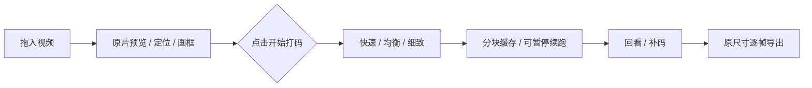

# 0.4.0 性能与使用方式（历史记录）

0.4.1 已修正误遮挡：取消检测失效后的自动补偿，移除轮廓的重复扩大，增加候选复核。下述计时和补偿行为描述的是 0.4.0，不能当作 0.4.1 的准确性结论。

2026-09-09。本机 Windows 11、Core Ultra 7 270K Plus、Radeon RX 9070 XT 16 GB。以下为单机样片测量，不代表其他显卡或所有视频；测试视频及截图不公开。

## 从导入就开始解码，改成先看再做

导入只读取基本信息和首帧尺寸。Qt 直接播放原片及原音轨；用户点击“开始打码”才加载模型、检查缓存、分析视频。没有整条视频的预览转码或波形预扫描。

## 样片耗时

同一段 852×480、约 30 fps、2041 帧、68 秒视频。首次完整分析，包含模型初始化及缓存写入；旧版还制作预览缓存，所以比较的是完整等待时间，不能只归功于 GPU。每档一次主要测量，未做统计置信区间。

| 方案 | 耗时 | 取舍 |
| --- | ---: | --- |
| 旧版 0.3.2 | 39.13 秒 | 逐帧 CPU 识别及预览转码 |
| 新版快速 | 6.47 秒 | 跳帧检测配合短时跟踪，五官近似，需多复查 |
| 新版均衡 | 25.27 秒 | 每帧多尺度检测与五官定位 |
| 新版细致 | 38.33 秒 | 增加模型与复检，整脸更保守，也可能误检 |

计时来自同次迭代的完整从头分析；随后修正了断点续跑的时间戳处理，未改变这三档的从头检测算法。检测到更多框不是准确率：未逐帧人工标注完整真值，不能据此声称召回率或精度提升百分比。

## 长视频、显卡和成片

- 约 11 分 21 秒的循环测试素材：20,410 帧。2340 帧暂停后续跑，最终帧数与独立完整解码完全相同。首次段约 7.05 秒，续跑约 52.20 秒；缓存约 3.9 MB，内存中最多 6 个几何块，完成缓存再次打开约 0.005 秒。循环素材不能代替数小时真实长片、多人物、频繁转场压力测试。
- CPU / D3D11VA 两种解码方式，续跑结果分别与各自完整解码对应帧逐像素一致。时间戳归零并明确禁用输出补帧，防止断点续跑重复前段。
- DirectML 的 YuNet 推理已在 RX 9070 XT 上实测；960×544 自动短测中 CPU 约 4.68 ms、GPU 约 0.93 ms。仅为模型调用时间，不是整条处理链速度。
- AMD AMF + D3D11VA 完整输出相机素材：1920×1080、50 fps、288 帧；原 PCM 解码采样全部相同。硬件编码的视频仍是有损 H.264，没有同码率画质胜过 CPU 的证据。
- 原有导出回归覆盖短 4K60 / 1080p120 样片、10 位 SDR、FFV1 像素比较、PCM 区间裁切、AAC、取消清理。支持高帧率输出不等于实时 4K120。

## 仍需检查的地方

脸只露一部分、背头、遮挡和运动模糊仍可能漏检。细致模式使用 YuNet 多尺度与镜像检测、已有 MediaPipe 包内的第二检测模型、短时光流补偿，并扩展整脸覆盖轮廓。它不是头部识别或跨镜头人物追踪；最多处理 6 张脸。

本机 1080p50 短测：原片约 2.02 秒收到 99 帧，打码预览约 2.03 秒绘制 99 帧，约 49 fps；20 ms 界面心跳在该短测中的最大间隔约 62 ms。快速连续跳转后显示最后指定帧通过验证。短测不能保证长片持续相同性能。

播放解除旧的约 32 fps 程序上限；原片走 Qt 视频窗口，处理预览使用只有一个待处理帧的后台队列，时间线缓存静态绘制。忙时可丢预览帧，源尺寸预览和大范围模糊仍可能降低流畅度。逐帧导出不会沿用预览丢帧。

DirectML 只加速 YuNet；MediaPipe 五官、光流、遮挡像素处理和部分缩放仍用 CPU。D3D11VA 输出还需传回 CPU，并非全程显存内处理。续跑省去已完成的推理，但仍顺序解码前段以保证时间线一致。

参考：[ONNX Runtime DirectML](https://onnxruntime.ai/docs/execution-providers/DirectML-ExecutionProvider.html)、[Qt 视频窗口](https://doc.qt.io/qt-6/qvideowidget.html)、[AMD AMF 参数](https://github.com/GPUOpen-LibrariesAndSDKs/AMF/wiki/AMF-Encoder-Settings-and-Tuning-in-FFmpeg)。
